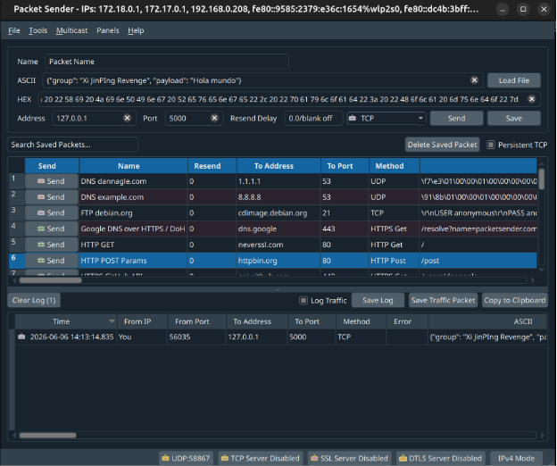
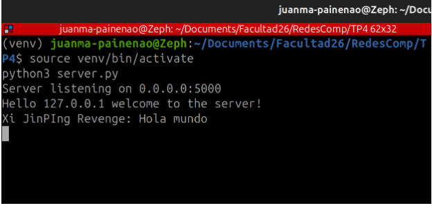
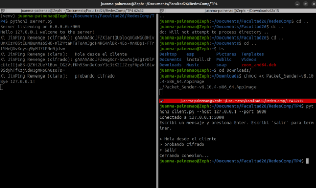
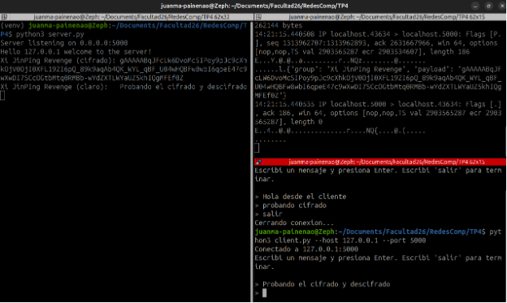

# Redes de Computadoras - Trabajo Práctico N° 4
**Nombres**  
_Gianluca Ferraris; Ezequiel J. Marredo; Juan M. Painenao; Alejandro R. Stangaferro;_  
**Xi JinPING Revenge**
**Facultad de Ciencias Exactas, Físicas y Naturales**  
**Redes de Computadoras**
**Profesores**
_Facundo O. Cuneo; Santiago M. Henn;_
**03-06-2026**

---

### Información de los autores

- **Información de contacto**: _[gianlucaferraris@mi.unc.edu.ar](mailto:gianlucaferraris@mi.unc.edu.ar); [ezequiel.marredo@mi.unc.edu.ar](mailto:ezequiel.marredo@mi.unc.edu.ar); [juanpainenao@mi.unc.edu.ar](mailto:juanpainenao@mi.unc.edu.ar); [alejandro.stangaferro@mi.unc.edu.ar](mailto:alejandro.stangaferro@mi.unc.edu.ar);_

---

## Consignas

### 1) Serialización

#### a) ¿Qué es la serialización en redes de computadoras?

La serialización es el proceso de convertir una estructura de datos u objeto residente en memoria en una secuencia lineal de bytes o caracteres que pueda transmitirse por la red y reconstruirse en el receptor mediante el proceso inverso, llamado deserialización.

Es necesaria porque los datos en memoria utilizan punteros, referencias y formatos propios de cada arquitectura y lenguaje (endianness, alineamiento, tamaño de los tipos) que no son transmisibles de forma directa, ya que el medio físico de la red solo transporta un flujo de bits. La serialización lleva esos datos a un formato portable y autocontenido que viaja como carga útil dentro de los paquetes de la capa de transporte. Gracias a ello, dos programas escritos en distintos lenguajes o ejecutados en distintas arquitecturas pueden intercambiar estructuras de datos de manera interoperable.

#### b) Diferencia entre serialización binaria y no binaria

|  | Binaria | No binaria (textual) |
|---|---|---|
| Formato | Bytes crudos, no legible por humanos | Texto plano (ASCII / UTF-8) |
| Ejemplos | Protocol Buffers, MessagePack, BSON, Avro | JSON, XML, YAML, CSV |
| Ventajas | Compacta, más rápida de serializar y deserializar, eficiente para tipos numéricos y datos binarios | Legible, fácil de depurar e inspeccionar, interoperable sin herramientas especiales, muy soportada |
| Desventajas | Difícil de inspeccionar sin herramientas, requiere un esquema compartido, más compleja de implementar | Mayor tamaño en bytes, parsing más lento, tipos a veces ambiguos |

Ejemplos concretos:

- JSON (no binaria): el mensaje viaja como el texto exacto que se observa abajo, legible directamente en un sniffer sin procesamiento adicional.

```json
{"group": "Xi JinPING Revenge", "payload": "hola"}
```

- Protocol Buffers (binaria): el mismo mensaje se codifica en pocos bytes con los campos identificados por número, ilegible a simple vista pero mucho más eficiente en ancho de banda.

---

### 2) Servidor TCP multi-hilo

Se desplegó un servidor TCP multi-hilo implementado en Python que escucha en 0.0.0.0:5000. Por cada conexión aceptada lanza un hilo independiente que ejecuta la función de atención al cliente, lo que permite atender varias conexiones de forma simultánea. El servidor valida que el mensaje recibido sea un JSON con los campos group y payload; si el formato es incorrecto o no puede deserializarse, avisa que el mensaje está mal formado.

Para ejecutarlo, dentro del entorno virtual:

```bash
python3 server.py
```

El servidor queda escuchando en 0.0.0.0:5000 hasta detenerlo con Ctrl+C.

#### a) Envío de un mensaje con PacketSender

Se serializó el paquete en JSON con la morfología requerida y se envió mediante PacketSender en modo TCP persistente hacia 127.0.0.1:5000, manteniendo la conexión abierta entre envíos.

```json
{"group": "Xi JinPING Revenge", "payload": "Hola mundo"}
```





El servidor recibió el paquete, lo deserializó correctamente y mostró por consola el grupo y la carga útil. Como PacketSender envía el texto sin cifrar, el servidor lo imprime tal cual lo recibe.





---

### 3) Aplicación de cliente

Se desarrolló un cliente en Python que permite enviar mensajes al servidor desde la consola de forma interactiva.

#### a) Configuración de IP y puerto

El cliente se configura por línea de comandos con la dirección y el puerto del servidor, establece la conexión TCP y mantiene la sesión abierta mientras el usuario envíe mensajes:

```bash
python3 client.py --host 127.0.0.1 --port 5000
```

#### b) Serialización de la información

Antes de cada envío, el cliente empaqueta la entrada del usuario en el formato JSON que el servidor admite y lo codifica en UTF-8. El campo group se fija con el nombre del grupo y payload contiene el texto a transmitir.

```python
mensaje = {"group": GROUP, "payload": payload_cifrada}
client.sendall(json.dumps(mensaje).encode("utf-8"))
```

#### c) Verificación del funcionamiento

Se ejecutaron el servidor y el cliente en paralelo sobre 127.0.0.1:5000. El servidor recibió y procesó correctamente cada mensaje enviado desde el cliente, validando el funcionamiento de la comunicación.


---

### 4) Cifrado de la carga útil

Para incorporar seguridad se agregó una capa de cifrado simétrico que protege únicamente la payload del mensaje, dejando el campo group en texto claro para poder identificar al emisor. Se utilizó Fernet, de la librería cryptography de Python.

#### a) Cifrado en el lado del cliente

El cliente carga una clave simétrica compartida desde un archivo y cifra la payload antes de serializar el mensaje:

```python
from cryptography.fernet import Fernet

cipher = Fernet(cargar_clave("clave.key"))

payload_cifrada = cipher.encrypt(texto.encode("utf-8")).decode("utf-8")
mensaje = {"group": GROUP, "payload": payload_cifrada}
```

#### b) Verificación de que la carga útil llega cifrada

El servidor recibe la payload como una cadena ilegible codificada en Base64 URL-safe, que comienza con gAAAAA. El campo group sigue llegando en texto claro. Esto confirma que la información sensible viaja cifrada por la red.





#### c) Características de la técnica de cifrado

Fernet es un esquema de cifrado autenticado de alto nivel que combina varios mecanismos:

- Cifrado simétrico: utiliza una única clave secreta tanto para cifrar como para descifrar. Ambos extremos deben conocerla de antemano. En este trabajo se comparte mediante un archivo de clave.
- AES-128 en modo CBC: el algoritmo es AES, estándar de cifrado por bloques ampliamente utilizado, con clave de 128 bits. En modo CBC cada bloque se combina con el bloque cifrado anterior antes de cifrarse, de modo que bloques de texto iguales producen resultados distintos.
- Vector de inicialización: Fernet genera un IV aleatorio en cada operación, lo que garantiza que cifrar el mismo texto dos veces produzca resultados completamente diferentes y dificulta identificar mensajes repetidos en el tráfico.
- Integridad y autenticidad: Fernet firma el mensaje con HMAC-SHA256. Si un tercero altera aunque sea un bit del texto cifrado, el receptor lo detecta y rechaza el mensaje. Así ofrece confidencialidad e integridad a la vez.
- Formato de salida: el resultado se codifica en Base64 URL-safe para poder embeberlo dentro del JSON, que es texto. Esto explica el aspecto de la cadena cifrada.

---

### 5) Descifrado en el servidor y captura de tráfico

Se adaptó el servidor para que, usando la misma clave compartida con el cliente, descifre la payload recibida. El servidor imprime tanto el texto cifrado que llegó por la red como el texto original ya descifrado.

```python
cifrado = message["payload"]
claro = cipher.decrypt(cifrado.encode("utf-8")).decode("utf-8")
print(f"{message['group']} (cifrado): {cifrado}")
print(f"{message['group']} (claro):   {claro}")
```

Para auditar el tráfico se capturaron los paquetes con tcpdump sobre la interfaz de loopback, filtrando el puerto del servicio, mientras el cliente y el servidor corrían en la misma máquina:

```bash
sudo tcpdump -i lo -A 'tcp port 5000'
```




La captura evidencia el funcionamiento de extremo a extremo: la payload viaja cifrada por la red, de modo que un atacante que interceptara el tráfico solo vería el texto cifrado, mientras que el servidor, al poseer la clave compartida, es el único capaz de recuperar el contenido original.

---

## Conclusiones

El trabajo permitió recorrer el camino completo de un mensaje en una aplicación de red, desde su organización hasta su protección. Se comprendió que la serialización es el paso indispensable para que datos estructurados en memoria puedan viajar por la red y ser interpretados de forma interoperable, y se justificó el uso de JSON como formato textual por su legibilidad y compatibilidad.

Sobre esa base se desplegó un servidor TCP multi-hilo capaz de atender varios clientes en paralelo y se desarrolló un cliente de consola configurable que serializa sus mensajes en el formato esperado. Finalmente, se incorporó cifrado simétrico con Fernet sobre la payload, verificando con una captura de tráfico que la información sensible nunca circula en texto plano y que solo el extremo que posee la clave compartida puede descifrarla. El resultado es un sistema que combina comunicación fiable, serialización interoperable y confidencialidad e integridad de la carga útil.
