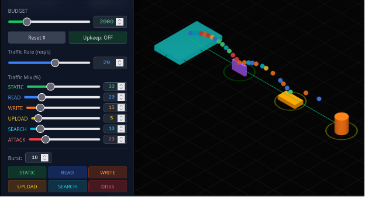
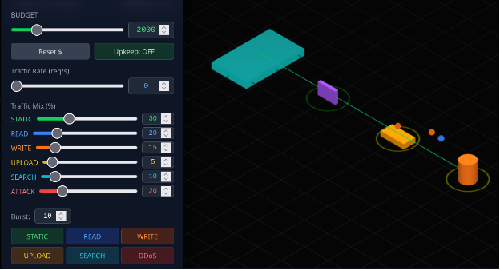
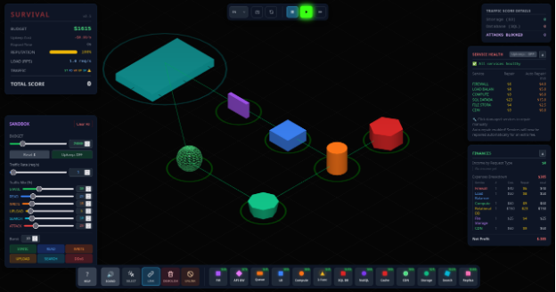
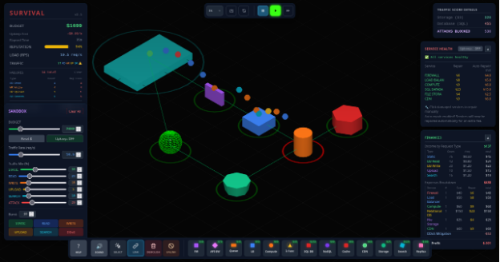
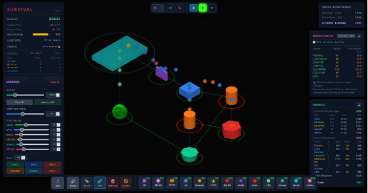
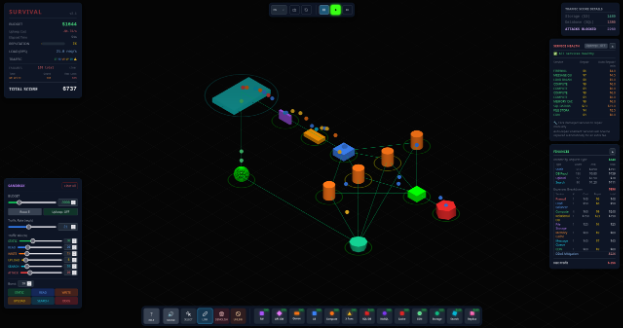
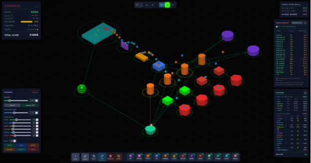
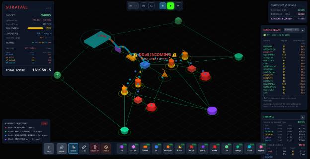
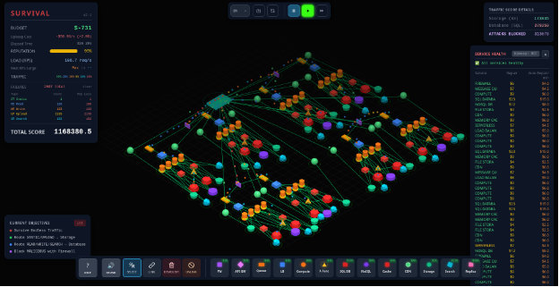

# Redes de Computadoras - Trabajo Práctico N° 5
**Nombres**  
_Gianluca Ferraris; Ezequiel J. Marredo; Juan M. Painenao; Alejandro R. Stangaferro;_  
**Xi JinPING Revenge**
**Facultad de Ciencias Exactas, Físicas y Naturales**  
**Redes de Computadoras**
**Profesores**
_Facundo O. Cuneo; Santiago M. Henn;_
**10-06-2026**

---

### Información de los autores

- **Información de contacto**: _[gianlucaferraris@mi.unc.edu.ar](mailto:gianlucaferraris@mi.unc.edu.ar); [ezequiel.marredo@mi.unc.edu.ar](mailto:ezequiel.marredo@mi.unc.edu.ar); [juanpainenao@mi.unc.edu.ar](mailto:juanpainenao@mi.unc.edu.ar); [alejandro.stangaferro@mi.unc.edu.ar](mailto:alejandro.stangaferro@mi.unc.edu.ar);_

---

## Consignas
# Trabajo Práctico N°5 — Arquitectura de servicios, tipos de tráfico y escalabilidad

Simulador utilizado: Server Survival (https://github.com/pshenok/server-survival).

---

## 1. Reconocimiento de arquitectura

| Componente | a) Problema que resuelve | b) Capa(s) TCP/IP | c) Qué pasa si falta |
| :--- | :--- | :--- | :--- |
| Firewall | Filtra el tráfico de entrada y bloquea solicitudes maliciosas (ataques, DDoS) antes de que lleguen a los servicios. | Internet y Transporte (filtrado por IP/puerto/estado); Aplicación si es un WAF que inspecciona contenido. | El tráfico malicioso llega directo: consume capacidad, degrada la salud de los nodos y hunde la reputación (−5 por ataque filtrado). |
| Load Balancer | Distribuye el tráfico entre varias instancias de cómputo, evitando que una sola se sature y habilitando el escalado horizontal. | Transporte (nivel 4, por IP/puerto) y/o Aplicación (nivel 7, por contenido HTTP). | No se puede repartir carga: una sola instancia concentra todo y se vuelve cuello de botella; agregar más nodos no sirve porque no hay quién distribuya hacia ellos. |
| Queue | Desacopla productor y consumidor: amortigua picos almacenando solicitudes para que el procesamiento las consuma a su ritmo, evitando descartes en ráfagas. | Aplicación (middleware de mensajería), sobre TCP en Transporte. | Ante un pico que supera la capacidad de cómputo, las solicitudes se pierden directamente, con caída de reputación. |
| Compute | Ejecuta la lógica de la aplicación: procesa cada solicitud y coordina accesos a base de datos, almacenamiento, etc. | Aplicación. | No hay quién procese el tráfico dinámico (read/write/search/upload); solo podría servirse estático cacheado. |
| Serverless Function | Cómputo de pago por uso que autoescala con la demanda; resuelve tráfico variable o de bajo volumen sin servidores siempre encendidos. | Aplicación. | No es imprescindible (lo suple el Compute), pero se pierde la elasticidad automática y la eficiencia de costo en cargas intermitentes. |
| SQL DB | Almacena y consulta datos estructurados con consistencia transaccional; atiende lecturas, escrituras y búsquedas. | Aplicación (protocolo propio sobre TCP). | No hay persistencia: caen read/write/search. Es de los componentes más caros y suele ser el primer cuello de botella si concentra todo el tráfico de datos. |
| NoSQL | Base no relacional optimizada para read/write de alto rendimiento y escalado horizontal; más rápida y barata que la SQL, pero no resuelve búsquedas. | Aplicación. | Todo el tráfico de datos recae sobre la SQL DB, que se satura antes y resulta más costosa. |
| Cache | Guarda en memoria respuestas frecuentes para devolverlas sin reconsultar la base, reduciendo carga sobre la DB y latencia. | Aplicación (cachés tipo Redis/Memcached). | Cada lectura golpea la base: sube la carga, la latencia y el costo, y la DB se satura mucho antes. |
| CDN | Cachea y distribuye contenido estático en nodos cercanos al usuario, sirviéndolo con muy alta tasa de acierto (95 %) sin tocar el origen. | Aplicación (entrega de contenido HTTP). | El estático se sirve desde el origen: se desperdicia cómputo y almacenamiento, con mayor latencia y costo. |
| Storage | Almacena archivos y objetos (estáticos y subidos por usuarios); destino de UPLOAD y origen de STATIC. | Aplicación (acceso por API/HTTP). | No hay dónde guardar ni desde dónde servir archivos: fallan uploads y contenido estático. |
| Search Engine | Motor especializado en búsquedas full-text; procesa SEARCH mucho más rápido que la base (3× en el simulador). | Aplicación. | SEARCH recae sobre la SQL DB y, al ser el tráfico más pesado (peso 2.5), la satura rápidamente. |
| Réplica (Read Replica) | Copia de solo lectura de la base maestra; descarga el tráfico de lectura para que el maestro se dedique a escrituras. | Aplicación. | Lecturas y escrituras compiten por la misma base maestra, que se satura antes bajo cargas de lectura intensas. |

## 2. Tipos de tráfico

| Tipo de tráfico | Ejemplo real | Componente recomendado | Riesgo si se procesa incorrectamente |
| :--- | :--- | :--- | :--- |
| STATIC | Imágenes, CSS, JavaScript de una página web | CDN (con respaldo en Storage) | Si lo sirve el servidor de aplicación/DB, se desperdicia capacidad de cómputo y se satura el origen |
| READ | Consultar un perfil, listar productos, leer un registro | Cache → Read Replica / NoSQL / SQL DB | Saturar la base maestra, aumentar la latencia y provocar fallos de lectura por falta de descarga (caché/réplica) |
| WRITE | Alta o edición de un registro (POST/PUT), publicar un comentario | NoSQL / SQL DB (no es cacheable) | Cuello de botella en la DB; las escrituras fallidas no se pueden recuperar con caché, hay riesgo de pérdida de datos |
| UPLOAD | Subir una foto, un documento o un video | Storage | Es el tráfico de mayor peso de procesamiento (2.0); si va a Compute/DB consume mucho cómputo y satura |
| SEARCH | Búsqueda full-text en un catálogo o buscador interno | Search Engine (respaldo en SQL DB) | Es el tráfico más pesado (2.5); si lo maneja la SQL DB la satura muy rápido, con latencia alta y fallos |
| MALICIOUS | DDoS, peticiones de ataque, escaneos | Firewall (debe bloquearlo) | Si se filtra, no genera ingreso, consume capacidad y hunde la reputación (−5 por ataque filtrado) |

---

## 3. Testeamos queues

### Incrementen el rate: que sucede después de la queue?

La queue entrega siempre el mismo rate de salida, sin importar el rate de entrada. Cuando el rate de entrada es mayor que el de salida, los paquetes se almacenan en la queue. Cuando llega al limite de 200 la queue empieza a descartar nuevos paquetes.

### Mantengan el rate alto y luego llevenlo a cero rápidamente. Qué sucede después de la queue?

La queue continua entregando paquetes que habia almacenado.

### Conclusión
La cola desacopla el ritmo de llegada (productor) del ritmo de procesamiento (consumidor). Suaviza

## 4. Primera infraestructura mínima

### a) La arquitectura inicial.

La arquitectura minima propuesta fue: firewall, load balancer, compute, SQL DB, storage y CDN. Esta arquitectura, constituye una base mínima sólida porque cubre con un solo componente cada uno de los tipos de tráfico exigidos, evitando puntos sin atender. El firewall se ubica en el ingreso y bloquea el tráfico malicioso antes de que consuma recursos o afecte la reputación, resolviendo la dimensión de seguridad. El CDN, respaldado por el storage, sirve el contenido estático con alta tasa de acierto sin recurrir al cómputo, mientras que el storage actúa tambien como destino de los uploads. El tráfico dinámico ingresa a través del load balancer hacia el compute, que procesa las solicitudes y las deriva a la SQL DB. Se elecciono SQL DB ya que es la unica que resuelve a la vez lecturas, escrituras y busquedas, a diferencia de NoSQL, que si bien es mas rapida, no resuelve busquedas. 

### b) El presupuesto inicial.

Presupuesto inicial antes de generar la arquitectura fue de 2000, luego de generar la arquitectura el presupuesto restante fue de 1615.

### c) El estado de salud de los servicios.

El estado de salud de los servicios fue bueno durante el transcurso del juego.

### d) El momento en que la arquitectura empieza a fallar, si ocurre.

### ¿Qué componente falló primero? 
El primer componente que fallo fue el computo ya que su capacidad es muy baja (4) y su tiempo de procesamiento alto (600 ms).

### ¿Por qué creés que falló? 
Porque concentra más tráfico del que su capacidad puede procesar a ese rate, las solicitudes se acumulan, su salud se degrada y empieza a descartar pedidos.

### ¿Fue un problema de capacidad, diseño, costo o seguridad? 
Fue un problema principalmente de capacidad y de diseño: un único Compute sin balanceo ni réplicas, y una sola DB atendiendo lectura, escritura y búsqueda juntas.

## 5. Escalabilidad y balanceo

A partir de la infraestructura mínima se probaron tres configuraciones sucesivas para soportar mayor tráfico, escalando primero la capa de cómputo y luego la capa de datos. Las tres corridas se documentan a continuación.
 
### Estrategia 1:
- Configuración: 2 instancias de Compute, 1 SQL DB y 1 Storage.
- Resultado: a 21 req/s ambas instancias de cómputo se saturaron.

- Análisis: el cuello de botella fue la capacidad de cómputo. Duplicar las instancias elevó el techo de procesamiento, pero cada Compute tiene capacidad baja (4), de modo que la capacidad combinada siguió siendo insuficiente: al llegar a 21 req/s la demanda superó lo que ambos nodos podían procesar y las solicitudes comenzaron a fallar.

### Estrategia 2:
- Configuración: 4 instancias de Compute más una Cache delante de la SQL DB.
- Resultado: la reputación cayó a 0 % por acumulación de errores (game over).

- Análisis: al sumar cómputo, el cuello de botella se desplazó hacia la base de datos única. La caché alivia las lecturas, pero no actúa sobre las escrituras (los WRITE no son cacheables), por lo que cuatro instancias de cómputo alimentando una sola SQL DB la saturaron igualmente. Los fallos acumulados llevaron la reputación a cero. Esta corrida evidencia que escalar un nivel sin atender al siguiente solo traslada el límite a otro componente.

### Estrategia 3:
- Configuración: se mantuvieron las 4 instancias de Compute, asignando a cada una su propia Cache y su propia SQL DB, y se agregaron dos NoSQL, de modo que dos instancias de cómputo se conectan a una NoSQL y las otras dos a la otra.

- Análisis: en lugar de concentrar todo el tráfico de datos en una sola base, la carga se reparte entre varios almacenes, de modo que ningún componente único actúa como cuello de botella. Cada cómputo dispone de caché local para sus lecturas y de una base dedicada para sus operaciones, y el reparto en dos NoSQL divide aún más la carga de read/write. Al atacar el verdadero cuello —la capa de datos— y no solo el cómputo, esta configuración es la que mejor sostiene el tráfico de las tres.

### ¿Escalar horizontalmente siempre mejora el sistema? 
No, y las tres corridas lo demuestran. Al pasar de la estrategia 1 a la 2, agregar más cómputo elevó el techo de procesamiento pero no resolvió el problema: solo movió el cuello de botella de las instancias de cómputo a la base de datos. La caché ayudó únicamente de forma parcial, porque no opera sobre las escrituras, lo que muestra que la mejora depende del tipo de tráfico y no solo de sumar recursos. 
Recién en la estrategia 3 el sistema mejoró de verdad, porque el escalado se aplicó sobre el componente que efectivamente estaba saturado (la capa de datos), particionándola. 
La conclusión es que el escalado horizontal mejora el sistema solo cuando se aplica sobre el nivel que realmente constituye el cuello de botella. Aplicado sobre el nivel equivocado, desplaza el problema a otro componente o incluso lo agrava por el upkeep adicional que introduce.

## 6. Sobrevivir (modo Survival)

### Arquitectura Inical:

La arquitectura se construyó replicando una unidad o nodo. Cada nodo se compone de: internet -> firewall -> queue -> load balancer -> 4 instancias de Compute. De los cuatro cómputos, dos acceden a una Cache y de ahí a una SQL DB, y los otros dos a una segunda Cache y SQL DB; los cuatro comparten además una NoSQL. Cada par de cómputos se conecta a un Storage, y cada Storage a un CDN expuesto a internet. Una Serverless Function toma trabajo desde la queue hacia las dos SQL DB. La arquitectura final está formada por 8 de estos nodos.
 

### Por qué elegiste cada componente.

- Firewall: como primera línea de ingreso, bloquea el tráfico malicioso antes de que consuma recursos, protegiendo la reputación (cada ataque filtrado resta reputación de forma severa).
- Queue: amortigua las ráfagas y los picos de tráfico antes del balanceo, desacoplando el ingreso del procesamiento para evitar descartes durante los surges.
- Load Balancer: reparte el tráfico entre las cuatro instancias de cómputo y habilita el escalado horizontal del nivel de cómputo.
- Compute (x4): es el núcleo de procesamiento del tráfico dinámico; se dispusieron cuatro porque el cómputo fue el primer cuello de botella detectado.
- Cache (x2): se ubican delante de cada SQL DB para resolver lecturas frecuentes sin golpear la base, reduciendo su carga y la latencia.
- SQL DB (x2): atienden lecturas, escrituras y búsquedas; son el único componente capaz de resolver SEARCH, y se duplicaron para repartir la carga de datos.
- NoSQL (x1): aporta lecturas y escrituras de alto rendimiento y bajo costo, descargando a las SQL DB de parte del tráfico de read/write.
- Storage (x2): destino de los uploads y origen del contenido estático.
- CDN (x2): sirven el contenido estático con alta tasa de acierto sin recurrir al cómputo.
- Serverless Function: aporta cómputo elástico de pago por uso que toma operaciones desde la queue hacia las SQL DB, absorbiendo el excedente sin mantener instancias encendidas de forma permanente.

### Qué tráfico atiende cada uno.

- Firewall: MALICIOUS (lo bloquea).
- CDN: STATIC.
- Storage: UPLOAD (y como origen del estático).
- Queue: todo el tráfico entrante, que almacena temporalmente antes de distribuirlo.
- Load Balancer: todo el tráfico dinámico, que reparte entre los cómputos.
- Compute: procesa READ, WRITE, SEARCH y UPLOAD, y orquesta los accesos a las capas de datos y almacenamiento.
- Cache: READ (aciertos de lectura).
- SQL DB: READ, WRITE y SEARCH.
- NoSQL: READ y WRITE.
- Serverless Function: excedente de operaciones hacia las SQL DB en momentos de pico.
 

### Qué cuello de botella apareció primero.

El primer cuello de botella fue el cómputo. Por ese motivo la estrategia de crecimiento consistió en agregar nodos: primero uno más, luego dos más y finalmente cuatro más, hasta alcanzar los 8 nodos de la arquitectura final.

### Qué componente escalarías si tuvieras más presupuesto.

La unidad de escalado es el nodo completo, es decir, el conjunto formado por la queue, el load balancer, los cuatro cómputos, las dos caches, las dos SQL DB, la NoSQL, los dos storages y los dos CDN (junto con el firewall y la serverless function). Con más presupuesto se replicarían más nodos. La razón es que replicar la unidad entera escala de forma equilibrada todos los niveles a la vez y evita el problema observado en el punto 5: al no escalar un solo componente de manera aislada, el cuello de botella no se desplaza a otro nivel, sino que la capacidad crece de manera proporcional en toda la arquitectura.
 

### Arquitectura final:

### Resultado final:

Perdimos por bancarrota debido a que escalamos mas de lo necesario (Agregando 4 nodos) lo cual supuso un coste por segundo mas elevado que el ingreso actual. Lo ideal hubiera sido esperar a que el sistema con los 4 nodos se sature, e ir agregando de a uno o dos nodos.
 
